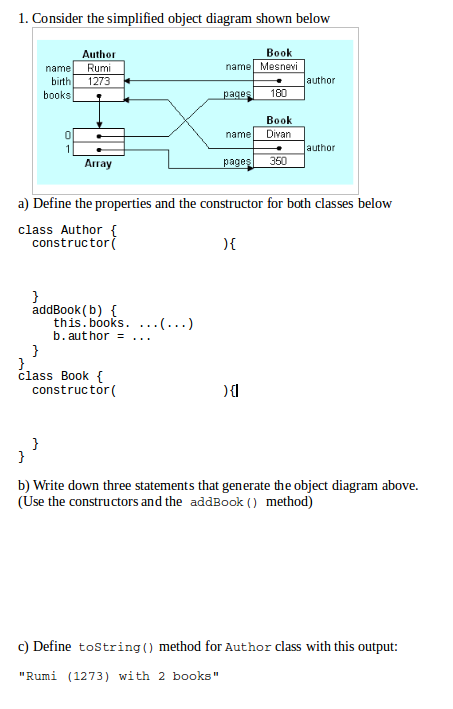

### Solution
```
class Author {
    constructor(n, b) {
        this.name = n
        this.birth = b 
        this.books = []
    }
    addBook(b) {
        this.books.push(b);
        b.author = this;
    }
    toString() {
        return this.name+" ("+this.birth+")"+
           " with "+this.books.length +" books"
    }
}

class Book {
    constructor(n, p, a) {
        this.name = n
        this.pages = p
        this.author = a
    }
    toString() { //not required in the quiz
        return this.name+" by "+this.author.name
    }
}

let a = new Author("Rumi", 1273)
a.addBook(new Book("Mesnevi", 180))
a.addBook(new Book("Divan", 350))
```

### Question


